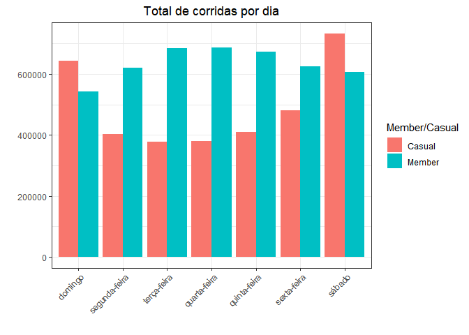
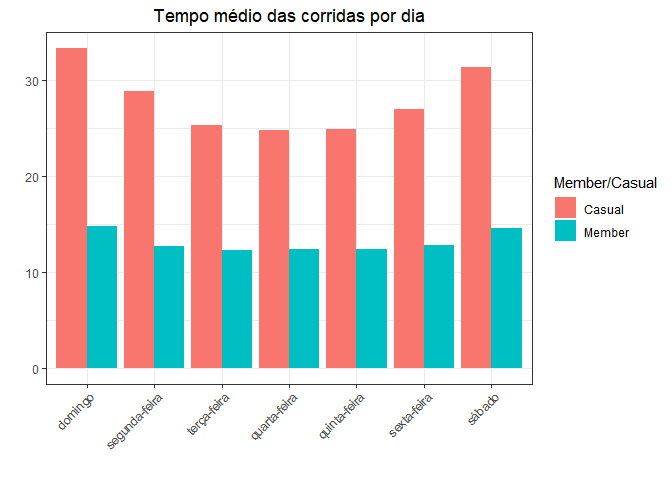
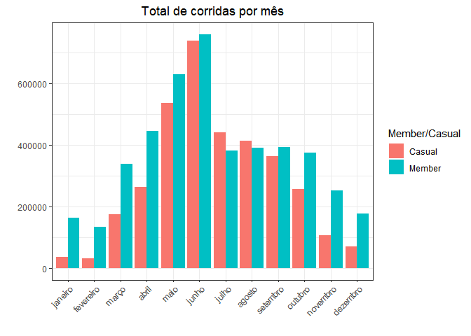
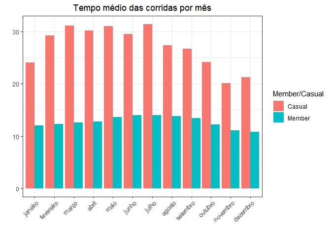
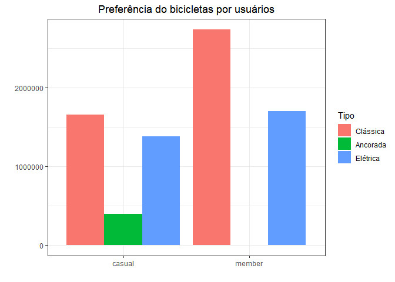
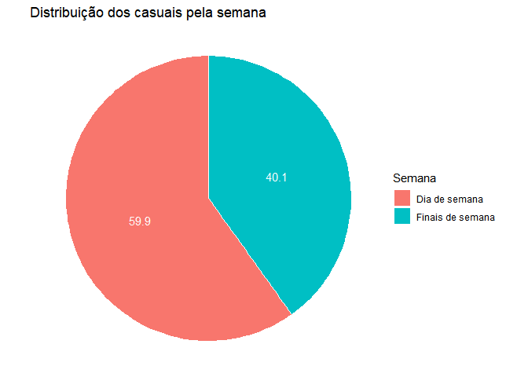
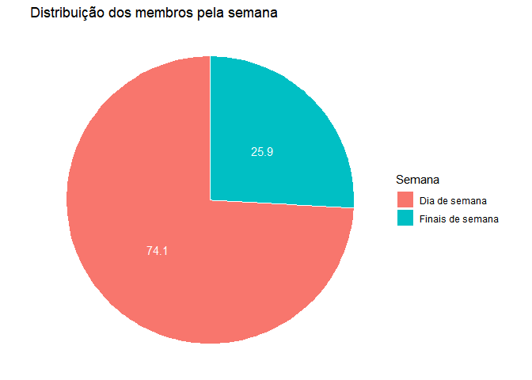
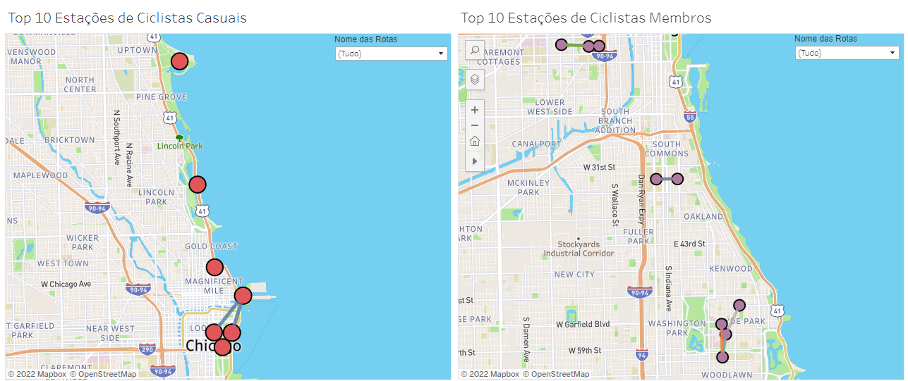

Cyclistic: Projeto Capstone do Google Data Analytics
================
Bruno Andrade

## How Does a Bike-Share Navigate Speedy Success?

<br />

### Cenário

<p>
Eu sou um analista de dados júnior trabalhando na equipe de analistas de
marketing da Cyclistic, empresa de bicicletas compartilhadas em Chicago.
<p>
<p>
A Cyclistic possui um programa de compartilhamento de bicicletas que
apresenta mais de 5.800 bicicletas e 600 estações (bicicletário). Além
de oferecer bicicletas reclináveis, triciclos manuais e bicicletas de
carga, a Cyclistic faz o compartilhamento de bicicletas mais inclusivo
para pessoas com deficiências e ciclistas que não podem usar uma
bicicleta padrão de duas rodas. A maioria dos ciclistas opta por
bicicletas tradicionais; cerca de 8% dos pilotos usam as opções
assistivas. Os usuários da Cyclistic são mais propensos a pedalar por
lazer, mas cerca de 30% os usam para ir para o trabalho todos os dias.
</p>
<p>
Os clientes que compram passes de viagem única ou de dia inteiro são
chamados de clientes casuais. Os clientes que fazem a assinatura anual
são membros Cyclistic.
</p>
<p>
O diretor de marketing acredita que o sucesso futuro da companhia
depende de maximizar os números de assinaturas anuais. Ademais, minha
equipe quer entender como os ciclistas casuais e os membros usam as
bicicletas Cyclistic de maneira diferente.
</p>
<p>
Com esses insights, minha equipe irá projetar uma nova estratégia de
marketing para converter clientes casuais em membros. Mas primeiro, os
executivos da Cyclistic deve aprovar as recomendações, por isso devemos
ser apoiados com insights de dados convincentes e visualização de dados
profissionais.
</p>
<p>
Esse projeto será completado seguindo as 6 etapas do processo de análise
de dados:
</p>
<ul>
<li>
<strong>Ask</strong>: Identificar a tarefa de negócio e determinar os
principais interessados.
</li>
<li>
<strong>Prepare</strong>: Coletar os dados, como organizar os dados e
determinar a credibilidade e integridade dos dados.
</li>
<li>
<strong>Process</strong>: Escolher as ferramentas para limpar os dados,
analisar erros e documentação do processo de limpeza.
</li>
<li>
<strong>Analyse</strong>: Organizar e formatar os dados, agregar os
dados de forma útil e acessível, fazer cálculos e identificar tendências
e relacionamentos.
</li>
<li>
<strong>Share</strong>: Usar abordagem de storytelling baseada em dados,
apresentar os resultados com visualização eficaz.E certificar que a
análise tenha respondido a tarefa de negócio
</li>
<li>
<strong>Act</strong>: Compartilhar a conclusão final e as recomendações
</li>
</ul>

<br /><br />

### Ask

<h5>
<strong>Tarefa de negócio (business task):</strong>
</h5>
<p>
Recomendar estratégias de marketing destinadas a converter clientes
casuais em membros anuais, levando em consideração um melhor
entendimento de como membros anuais e ciclistas casuais usam as
bicicletas Cyclistic de maneira diferente
</p>
<h5>
<strong>Stakeholders</strong>
</h5>
<ul>
<li>
<strong>Lily Moreno</strong>: o diretor de marketing e meu gerente
</li>
<li>
<strong>Equipe Executiva da Cyclistic</strong>: uma equipe executiva
detalhista decidirá se aprova o programa de marketing recomendado
</li>
<li>
<strong>Equipe de análise de marketing Cyclistic</strong>: uma equipe de
analista de dados que é responsável por coletar, analisar e reportar
dados que ajude a guiar a estratégia de marketing Cyclistic.
</li>
</ul>

<br />

### Prepare

<p>
Eu usarei os dados públicos dos dados históricos de viagem Cyclistic que
fica em Chicago, para analisar e identificar tendências.Os dados estão
disponíveis por
<a href="https://divvy-tripdata.s3.amazonaws.com/index.html"> Motivate
International Inc.</a> sob está
<a href="https://ride.divvybikes.com/data-license-agreement">licença</a>.
</p>
<p>
Para análise eu baixei 18 arquivos CSV de janeiro de 2021 à junho de
2022. Estou usando o Google Sheets para ter uma ideia dos dados. Cada
arquivo CSV corresponde a um mês e contém detalhes do id da corrida,
tipo do veículo, horario do começo e fim, a estação que começa e aonde
termina, latitude e longitude do começo e fim das estações, e se é
ciclista casual ou membro
</p>

### Process

<p>
Irei usar a linguagem R para fazer a limpeza, organização e análises dos
dados. Como por exemplo, se todas as colunas tem o tipo de dados
apropriados, encontrar outliers e se qualquer um desses dados tem alguma
propensão na amostragem
</p>

``` r
# Carregar o tidyverse, lubridate, ggplot2 libraries
library(tidyverse)
```

    ## Warning: package 'tidyverse' was built under R version 4.2.1

    ## ── Attaching packages ─────────────────────────────────────── tidyverse 1.3.2 ──
    ## ✔ ggplot2 3.3.6     ✔ purrr   0.3.4
    ## ✔ tibble  3.1.7     ✔ dplyr   1.0.9
    ## ✔ tidyr   1.2.0     ✔ stringr 1.4.1
    ## ✔ readr   2.1.3     ✔ forcats 0.5.2

    ## Warning: package 'ggplot2' was built under R version 4.2.1

    ## Warning: package 'tidyr' was built under R version 4.2.1

    ## Warning: package 'readr' was built under R version 4.2.1

    ## Warning: package 'stringr' was built under R version 4.2.1

    ## Warning: package 'forcats' was built under R version 4.2.1

    ## ── Conflicts ────────────────────────────────────────── tidyverse_conflicts() ──
    ## ✖ dplyr::filter() masks stats::filter()
    ## ✖ dplyr::lag()    masks stats::lag()

``` r
library(lubridate)
```

    ## Warning: package 'lubridate' was built under R version 4.2.1

    ## 
    ## Attaching package: 'lubridate'
    ## 
    ## The following objects are masked from 'package:base':
    ## 
    ##     date, intersect, setdiff, union

``` r
library(ggplot2)
```

``` r
# Importar os arquivos CSVs
data_202101 <- read_csv("datasets/202101-divvy-tripdata.csv")
```

    ## Rows: 96834 Columns: 13
    ## ── Column specification ────────────────────────────────────────────────────────
    ## Delimiter: ","
    ## chr  (7): ride_id, rideable_type, start_station_name, start_station_id, end_...
    ## dbl  (4): start_lat, start_lng, end_lat, end_lng
    ## dttm (2): started_at, ended_at
    ## 
    ## ℹ Use `spec()` to retrieve the full column specification for this data.
    ## ℹ Specify the column types or set `show_col_types = FALSE` to quiet this message.

``` r
data_202102 <- read_csv("datasets/202102-divvy-tripdata.csv")
```

    ## Rows: 49622 Columns: 13
    ## ── Column specification ────────────────────────────────────────────────────────
    ## Delimiter: ","
    ## chr  (7): ride_id, rideable_type, start_station_name, start_station_id, end_...
    ## dbl  (4): start_lat, start_lng, end_lat, end_lng
    ## dttm (2): started_at, ended_at
    ## 
    ## ℹ Use `spec()` to retrieve the full column specification for this data.
    ## ℹ Specify the column types or set `show_col_types = FALSE` to quiet this message.

``` r
data_202103 <- read_csv("datasets/202103-divvy-tripdata.csv")
```

    ## Rows: 228496 Columns: 13
    ## ── Column specification ────────────────────────────────────────────────────────
    ## Delimiter: ","
    ## chr  (7): ride_id, rideable_type, start_station_name, start_station_id, end_...
    ## dbl  (4): start_lat, start_lng, end_lat, end_lng
    ## dttm (2): started_at, ended_at
    ## 
    ## ℹ Use `spec()` to retrieve the full column specification for this data.
    ## ℹ Specify the column types or set `show_col_types = FALSE` to quiet this message.

``` r
data_202104 <- read_csv("datasets/202104-divvy-tripdata.csv")
```

    ## Rows: 337230 Columns: 13
    ## ── Column specification ────────────────────────────────────────────────────────
    ## Delimiter: ","
    ## chr  (7): ride_id, rideable_type, start_station_name, start_station_id, end_...
    ## dbl  (4): start_lat, start_lng, end_lat, end_lng
    ## dttm (2): started_at, ended_at
    ## 
    ## ℹ Use `spec()` to retrieve the full column specification for this data.
    ## ℹ Specify the column types or set `show_col_types = FALSE` to quiet this message.

``` r
data_202105 <- read_csv("datasets/202105-divvy-tripdata.csv")
```

    ## Rows: 531633 Columns: 13
    ## ── Column specification ────────────────────────────────────────────────────────
    ## Delimiter: ","
    ## chr  (7): ride_id, rideable_type, start_station_name, start_station_id, end_...
    ## dbl  (4): start_lat, start_lng, end_lat, end_lng
    ## dttm (2): started_at, ended_at
    ## 
    ## ℹ Use `spec()` to retrieve the full column specification for this data.
    ## ℹ Specify the column types or set `show_col_types = FALSE` to quiet this message.

``` r
data_202106 <- read_csv("datasets/202106-divvy-tripdata.csv")
```

    ## Rows: 729595 Columns: 13
    ## ── Column specification ────────────────────────────────────────────────────────
    ## Delimiter: ","
    ## chr  (7): ride_id, rideable_type, start_station_name, start_station_id, end_...
    ## dbl  (4): start_lat, start_lng, end_lat, end_lng
    ## dttm (2): started_at, ended_at
    ## 
    ## ℹ Use `spec()` to retrieve the full column specification for this data.
    ## ℹ Specify the column types or set `show_col_types = FALSE` to quiet this message.

``` r
data_202107 <- read_csv("datasets/202107-divvy-tripdata.csv")
```

    ## Rows: 822410 Columns: 13
    ## ── Column specification ────────────────────────────────────────────────────────
    ## Delimiter: ","
    ## chr  (7): ride_id, rideable_type, start_station_name, start_station_id, end_...
    ## dbl  (4): start_lat, start_lng, end_lat, end_lng
    ## dttm (2): started_at, ended_at
    ## 
    ## ℹ Use `spec()` to retrieve the full column specification for this data.
    ## ℹ Specify the column types or set `show_col_types = FALSE` to quiet this message.

``` r
data_202108 <- read_csv("datasets/202108-divvy-tripdata.csv")
```

    ## Rows: 804352 Columns: 13
    ## ── Column specification ────────────────────────────────────────────────────────
    ## Delimiter: ","
    ## chr  (7): ride_id, rideable_type, start_station_name, start_station_id, end_...
    ## dbl  (4): start_lat, start_lng, end_lat, end_lng
    ## dttm (2): started_at, ended_at
    ## 
    ## ℹ Use `spec()` to retrieve the full column specification for this data.
    ## ℹ Specify the column types or set `show_col_types = FALSE` to quiet this message.

``` r
data_202109 <- read_csv("datasets/202109-divvy-tripdata.csv")
```

    ## Rows: 756147 Columns: 13
    ## ── Column specification ────────────────────────────────────────────────────────
    ## Delimiter: ","
    ## chr  (7): ride_id, rideable_type, start_station_name, start_station_id, end_...
    ## dbl  (4): start_lat, start_lng, end_lat, end_lng
    ## dttm (2): started_at, ended_at
    ## 
    ## ℹ Use `spec()` to retrieve the full column specification for this data.
    ## ℹ Specify the column types or set `show_col_types = FALSE` to quiet this message.

``` r
data_202110 <- read_csv("datasets/202110-divvy-tripdata.csv")
```

    ## Rows: 631226 Columns: 13
    ## ── Column specification ────────────────────────────────────────────────────────
    ## Delimiter: ","
    ## chr  (7): ride_id, rideable_type, start_station_name, start_station_id, end_...
    ## dbl  (4): start_lat, start_lng, end_lat, end_lng
    ## dttm (2): started_at, ended_at
    ## 
    ## ℹ Use `spec()` to retrieve the full column specification for this data.
    ## ℹ Specify the column types or set `show_col_types = FALSE` to quiet this message.

``` r
data_202111 <- read_csv("datasets/202111-divvy-tripdata.csv")
```

    ## Rows: 359978 Columns: 13
    ## ── Column specification ────────────────────────────────────────────────────────
    ## Delimiter: ","
    ## chr  (7): ride_id, rideable_type, start_station_name, start_station_id, end_...
    ## dbl  (4): start_lat, start_lng, end_lat, end_lng
    ## dttm (2): started_at, ended_at
    ## 
    ## ℹ Use `spec()` to retrieve the full column specification for this data.
    ## ℹ Specify the column types or set `show_col_types = FALSE` to quiet this message.

``` r
data_202112 <- read_csv("datasets/202112-divvy-tripdata.csv")
```

    ## Rows: 247540 Columns: 13
    ## ── Column specification ────────────────────────────────────────────────────────
    ## Delimiter: ","
    ## chr  (7): ride_id, rideable_type, start_station_name, start_station_id, end_...
    ## dbl  (4): start_lat, start_lng, end_lat, end_lng
    ## dttm (2): started_at, ended_at
    ## 
    ## ℹ Use `spec()` to retrieve the full column specification for this data.
    ## ℹ Specify the column types or set `show_col_types = FALSE` to quiet this message.

``` r
data_202201 <- read_csv("datasets/202201-divvy-tripdata.csv")
```

    ## Rows: 103770 Columns: 13
    ## ── Column specification ────────────────────────────────────────────────────────
    ## Delimiter: ","
    ## chr  (7): ride_id, rideable_type, start_station_name, start_station_id, end_...
    ## dbl  (4): start_lat, start_lng, end_lat, end_lng
    ## dttm (2): started_at, ended_at
    ## 
    ## ℹ Use `spec()` to retrieve the full column specification for this data.
    ## ℹ Specify the column types or set `show_col_types = FALSE` to quiet this message.

``` r
data_202202 <- read_csv("datasets/202202-divvy-tripdata.csv")
```

    ## Rows: 115609 Columns: 13
    ## ── Column specification ────────────────────────────────────────────────────────
    ## Delimiter: ","
    ## chr  (7): ride_id, rideable_type, start_station_name, start_station_id, end_...
    ## dbl  (4): start_lat, start_lng, end_lat, end_lng
    ## dttm (2): started_at, ended_at
    ## 
    ## ℹ Use `spec()` to retrieve the full column specification for this data.
    ## ℹ Specify the column types or set `show_col_types = FALSE` to quiet this message.

``` r
data_202203 <- read_csv("datasets/202203-divvy-tripdata.csv")
```

    ## Rows: 284042 Columns: 13
    ## ── Column specification ────────────────────────────────────────────────────────
    ## Delimiter: ","
    ## chr  (7): ride_id, rideable_type, start_station_name, start_station_id, end_...
    ## dbl  (4): start_lat, start_lng, end_lat, end_lng
    ## dttm (2): started_at, ended_at
    ## 
    ## ℹ Use `spec()` to retrieve the full column specification for this data.
    ## ℹ Specify the column types or set `show_col_types = FALSE` to quiet this message.

``` r
data_202204 <- read_csv("datasets/202204-divvy-tripdata.csv")
```

    ## Rows: 371249 Columns: 13
    ## ── Column specification ────────────────────────────────────────────────────────
    ## Delimiter: ","
    ## chr  (7): ride_id, rideable_type, start_station_name, start_station_id, end_...
    ## dbl  (4): start_lat, start_lng, end_lat, end_lng
    ## dttm (2): started_at, ended_at
    ## 
    ## ℹ Use `spec()` to retrieve the full column specification for this data.
    ## ℹ Specify the column types or set `show_col_types = FALSE` to quiet this message.

``` r
data_202205 <- read_csv("datasets/202205-divvy-tripdata.csv")
```

    ## Rows: 634858 Columns: 13
    ## ── Column specification ────────────────────────────────────────────────────────
    ## Delimiter: ","
    ## chr  (7): ride_id, rideable_type, start_station_name, start_station_id, end_...
    ## dbl  (4): start_lat, start_lng, end_lat, end_lng
    ## dttm (2): started_at, ended_at
    ## 
    ## ℹ Use `spec()` to retrieve the full column specification for this data.
    ## ℹ Specify the column types or set `show_col_types = FALSE` to quiet this message.

``` r
data_202206 <- read_csv("datasets/202206-divvy-tripdata.csv")
```

    ## Rows: 769204 Columns: 13
    ## ── Column specification ────────────────────────────────────────────────────────
    ## Delimiter: ","
    ## chr  (7): ride_id, rideable_type, start_station_name, start_station_id, end_...
    ## dbl  (4): start_lat, start_lng, end_lat, end_lng
    ## dttm (2): started_at, ended_at
    ## 
    ## ℹ Use `spec()` to retrieve the full column specification for this data.
    ## ℹ Specify the column types or set `show_col_types = FALSE` to quiet this message.

``` r
# Visualizar a estrutura dos dados
str(data_202101)
```

    ## spec_tbl_df [96,834 × 13] (S3: spec_tbl_df/tbl_df/tbl/data.frame)
    ##  $ ride_id           : chr [1:96834] "E19E6F1B8D4C42ED" "DC88F20C2C55F27F" "EC45C94683FE3F27" "4FA453A75AE377DB" ...
    ##  $ rideable_type     : chr [1:96834] "electric_bike" "electric_bike" "electric_bike" "electric_bike" ...
    ##  $ started_at        : POSIXct[1:96834], format: "2021-01-23 16:14:19" "2021-01-27 18:43:08" ...
    ##  $ ended_at          : POSIXct[1:96834], format: "2021-01-23 16:24:44" "2021-01-27 18:47:12" ...
    ##  $ start_station_name: chr [1:96834] "California Ave & Cortez St" "California Ave & Cortez St" "California Ave & Cortez St" "California Ave & Cortez St" ...
    ##  $ start_station_id  : chr [1:96834] "17660" "17660" "17660" "17660" ...
    ##  $ end_station_name  : chr [1:96834] NA NA NA NA ...
    ##  $ end_station_id    : chr [1:96834] NA NA NA NA ...
    ##  $ start_lat         : num [1:96834] 41.9 41.9 41.9 41.9 41.9 ...
    ##  $ start_lng         : num [1:96834] -87.7 -87.7 -87.7 -87.7 -87.7 ...
    ##  $ end_lat           : num [1:96834] 41.9 41.9 41.9 41.9 41.9 ...
    ##  $ end_lng           : num [1:96834] -87.7 -87.7 -87.7 -87.7 -87.7 ...
    ##  $ member_casual     : chr [1:96834] "member" "member" "member" "member" ...
    ##  - attr(*, "spec")=
    ##   .. cols(
    ##   ..   ride_id = col_character(),
    ##   ..   rideable_type = col_character(),
    ##   ..   started_at = col_datetime(format = ""),
    ##   ..   ended_at = col_datetime(format = ""),
    ##   ..   start_station_name = col_character(),
    ##   ..   start_station_id = col_character(),
    ##   ..   end_station_name = col_character(),
    ##   ..   end_station_id = col_character(),
    ##   ..   start_lat = col_double(),
    ##   ..   start_lng = col_double(),
    ##   ..   end_lat = col_double(),
    ##   ..   end_lng = col_double(),
    ##   ..   member_casual = col_character()
    ##   .. )
    ##  - attr(*, "problems")=<externalptr>

``` r
str(data_202102)
```

    ## spec_tbl_df [49,622 × 13] (S3: spec_tbl_df/tbl_df/tbl/data.frame)
    ##  $ ride_id           : chr [1:49622] "89E7AA6C29227EFF" "0FEFDE2603568365" "E6159D746B2DBB91" "B32D3199F1C2E75B" ...
    ##  $ rideable_type     : chr [1:49622] "classic_bike" "classic_bike" "electric_bike" "classic_bike" ...
    ##  $ started_at        : POSIXct[1:49622], format: "2021-02-12 16:14:56" "2021-02-14 17:52:38" ...
    ##  $ ended_at          : POSIXct[1:49622], format: "2021-02-12 16:21:43" "2021-02-14 18:12:09" ...
    ##  $ start_station_name: chr [1:49622] "Glenwood Ave & Touhy Ave" "Glenwood Ave & Touhy Ave" "Clark St & Lake St" "Wood St & Chicago Ave" ...
    ##  $ start_station_id  : chr [1:49622] "525" "525" "KA1503000012" "637" ...
    ##  $ end_station_name  : chr [1:49622] "Sheridan Rd & Columbia Ave" "Bosworth Ave & Howard St" "State St & Randolph St" "Honore St & Division St" ...
    ##  $ end_station_id    : chr [1:49622] "660" "16806" "TA1305000029" "TA1305000034" ...
    ##  $ start_lat         : num [1:49622] 42 42 41.9 41.9 41.8 ...
    ##  $ start_lng         : num [1:49622] -87.7 -87.7 -87.6 -87.7 -87.6 ...
    ##  $ end_lat           : num [1:49622] 42 42 41.9 41.9 41.8 ...
    ##  $ end_lng           : num [1:49622] -87.7 -87.7 -87.6 -87.7 -87.6 ...
    ##  $ member_casual     : chr [1:49622] "member" "casual" "member" "member" ...
    ##  - attr(*, "spec")=
    ##   .. cols(
    ##   ..   ride_id = col_character(),
    ##   ..   rideable_type = col_character(),
    ##   ..   started_at = col_datetime(format = ""),
    ##   ..   ended_at = col_datetime(format = ""),
    ##   ..   start_station_name = col_character(),
    ##   ..   start_station_id = col_character(),
    ##   ..   end_station_name = col_character(),
    ##   ..   end_station_id = col_character(),
    ##   ..   start_lat = col_double(),
    ##   ..   start_lng = col_double(),
    ##   ..   end_lat = col_double(),
    ##   ..   end_lng = col_double(),
    ##   ..   member_casual = col_character()
    ##   .. )
    ##  - attr(*, "problems")=<externalptr>

``` r
str(data_202103)
```

    ## spec_tbl_df [228,496 × 13] (S3: spec_tbl_df/tbl_df/tbl/data.frame)
    ##  $ ride_id           : chr [1:228496] "CFA86D4455AA1030" "30D9DC61227D1AF3" "846D87A15682A284" "994D05AA75A168F2" ...
    ##  $ rideable_type     : chr [1:228496] "classic_bike" "classic_bike" "classic_bike" "classic_bike" ...
    ##  $ started_at        : POSIXct[1:228496], format: "2021-03-16 08:32:30" "2021-03-28 01:26:28" ...
    ##  $ ended_at          : POSIXct[1:228496], format: "2021-03-16 08:36:34" "2021-03-28 01:36:55" ...
    ##  $ start_station_name: chr [1:228496] "Humboldt Blvd & Armitage Ave" "Humboldt Blvd & Armitage Ave" "Shields Ave & 28th Pl" "Winthrop Ave & Lawrence Ave" ...
    ##  $ start_station_id  : chr [1:228496] "15651" "15651" "15443" "TA1308000021" ...
    ##  $ end_station_name  : chr [1:228496] "Stave St & Armitage Ave" "Central Park Ave & Bloomingdale Ave" "Halsted St & 35th St" "Broadway & Sheridan Rd" ...
    ##  $ end_station_id    : chr [1:228496] "13266" "18017" "TA1308000043" "13323" ...
    ##  $ start_lat         : num [1:228496] 41.9 41.9 41.8 42 42 ...
    ##  $ start_lng         : num [1:228496] -87.7 -87.7 -87.6 -87.7 -87.7 ...
    ##  $ end_lat           : num [1:228496] 41.9 41.9 41.8 42 42.1 ...
    ##  $ end_lng           : num [1:228496] -87.7 -87.7 -87.6 -87.6 -87.7 ...
    ##  $ member_casual     : chr [1:228496] "casual" "casual" "casual" "casual" ...
    ##  - attr(*, "spec")=
    ##   .. cols(
    ##   ..   ride_id = col_character(),
    ##   ..   rideable_type = col_character(),
    ##   ..   started_at = col_datetime(format = ""),
    ##   ..   ended_at = col_datetime(format = ""),
    ##   ..   start_station_name = col_character(),
    ##   ..   start_station_id = col_character(),
    ##   ..   end_station_name = col_character(),
    ##   ..   end_station_id = col_character(),
    ##   ..   start_lat = col_double(),
    ##   ..   start_lng = col_double(),
    ##   ..   end_lat = col_double(),
    ##   ..   end_lng = col_double(),
    ##   ..   member_casual = col_character()
    ##   .. )
    ##  - attr(*, "problems")=<externalptr>

``` r
str(data_202104)
```

    ## spec_tbl_df [337,230 × 13] (S3: spec_tbl_df/tbl_df/tbl/data.frame)
    ##  $ ride_id           : chr [1:337230] "6C992BD37A98A63F" "1E0145613A209000" "E498E15508A80BAD" "1887262AD101C604" ...
    ##  $ rideable_type     : chr [1:337230] "classic_bike" "docked_bike" "docked_bike" "classic_bike" ...
    ##  $ started_at        : POSIXct[1:337230], format: "2021-04-12 18:25:36" "2021-04-27 17:27:11" ...
    ##  $ ended_at          : POSIXct[1:337230], format: "2021-04-12 18:56:55" "2021-04-27 18:31:29" ...
    ##  $ start_station_name: chr [1:337230] "State St & Pearson St" "Dorchester Ave & 49th St" "Loomis Blvd & 84th St" "Honore St & Division St" ...
    ##  $ start_station_id  : chr [1:337230] "TA1307000061" "KA1503000069" "20121" "TA1305000034" ...
    ##  $ end_station_name  : chr [1:337230] "Southport Ave & Waveland Ave" "Dorchester Ave & 49th St" "Loomis Blvd & 84th St" "Southport Ave & Waveland Ave" ...
    ##  $ end_station_id    : chr [1:337230] "13235" "KA1503000069" "20121" "13235" ...
    ##  $ start_lat         : num [1:337230] 41.9 41.8 41.7 41.9 41.7 ...
    ##  $ start_lng         : num [1:337230] -87.6 -87.6 -87.7 -87.7 -87.7 ...
    ##  $ end_lat           : num [1:337230] 41.9 41.8 41.7 41.9 41.7 ...
    ##  $ end_lng           : num [1:337230] -87.7 -87.6 -87.7 -87.7 -87.7 ...
    ##  $ member_casual     : chr [1:337230] "member" "casual" "casual" "member" ...
    ##  - attr(*, "spec")=
    ##   .. cols(
    ##   ..   ride_id = col_character(),
    ##   ..   rideable_type = col_character(),
    ##   ..   started_at = col_datetime(format = ""),
    ##   ..   ended_at = col_datetime(format = ""),
    ##   ..   start_station_name = col_character(),
    ##   ..   start_station_id = col_character(),
    ##   ..   end_station_name = col_character(),
    ##   ..   end_station_id = col_character(),
    ##   ..   start_lat = col_double(),
    ##   ..   start_lng = col_double(),
    ##   ..   end_lat = col_double(),
    ##   ..   end_lng = col_double(),
    ##   ..   member_casual = col_character()
    ##   .. )
    ##  - attr(*, "problems")=<externalptr>

``` r
str(data_202105)
```

    ## spec_tbl_df [531,633 × 13] (S3: spec_tbl_df/tbl_df/tbl/data.frame)
    ##  $ ride_id           : chr [1:531633] "C809ED75D6160B2A" "DD59FDCE0ACACAF3" "0AB83CB88C43EFC2" "7881AC6D39110C60" ...
    ##  $ rideable_type     : chr [1:531633] "electric_bike" "electric_bike" "electric_bike" "electric_bike" ...
    ##  $ started_at        : POSIXct[1:531633], format: "2021-05-30 11:58:15" "2021-05-30 11:29:14" ...
    ##  $ ended_at          : POSIXct[1:531633], format: "2021-05-30 12:10:39" "2021-05-30 12:14:09" ...
    ##  $ start_station_name: chr [1:531633] NA NA NA NA ...
    ##  $ start_station_id  : chr [1:531633] NA NA NA NA ...
    ##  $ end_station_name  : chr [1:531633] NA NA NA NA ...
    ##  $ end_station_id    : chr [1:531633] NA NA NA NA ...
    ##  $ start_lat         : num [1:531633] 41.9 41.9 41.9 41.9 41.9 ...
    ##  $ start_lng         : num [1:531633] -87.6 -87.6 -87.7 -87.7 -87.7 ...
    ##  $ end_lat           : num [1:531633] 41.9 41.8 41.9 41.9 41.9 ...
    ##  $ end_lng           : num [1:531633] -87.6 -87.6 -87.7 -87.7 -87.7 ...
    ##  $ member_casual     : chr [1:531633] "casual" "casual" "casual" "casual" ...
    ##  - attr(*, "spec")=
    ##   .. cols(
    ##   ..   ride_id = col_character(),
    ##   ..   rideable_type = col_character(),
    ##   ..   started_at = col_datetime(format = ""),
    ##   ..   ended_at = col_datetime(format = ""),
    ##   ..   start_station_name = col_character(),
    ##   ..   start_station_id = col_character(),
    ##   ..   end_station_name = col_character(),
    ##   ..   end_station_id = col_character(),
    ##   ..   start_lat = col_double(),
    ##   ..   start_lng = col_double(),
    ##   ..   end_lat = col_double(),
    ##   ..   end_lng = col_double(),
    ##   ..   member_casual = col_character()
    ##   .. )
    ##  - attr(*, "problems")=<externalptr>

``` r
str(data_202106)
```

    ## spec_tbl_df [729,595 × 13] (S3: spec_tbl_df/tbl_df/tbl/data.frame)
    ##  $ ride_id           : chr [1:729595] "99FEC93BA843FB20" "06048DCFC8520CAF" "9598066F68045DF2" "B03C0FE48C412214" ...
    ##  $ rideable_type     : chr [1:729595] "electric_bike" "electric_bike" "electric_bike" "electric_bike" ...
    ##  $ started_at        : POSIXct[1:729595], format: "2021-06-13 14:31:28" "2021-06-04 11:18:02" ...
    ##  $ ended_at          : POSIXct[1:729595], format: "2021-06-13 14:34:11" "2021-06-04 11:24:19" ...
    ##  $ start_station_name: chr [1:729595] NA NA NA NA ...
    ##  $ start_station_id  : chr [1:729595] NA NA NA NA ...
    ##  $ end_station_name  : chr [1:729595] NA NA NA NA ...
    ##  $ end_station_id    : chr [1:729595] NA NA NA NA ...
    ##  $ start_lat         : num [1:729595] 41.8 41.8 41.8 41.8 41.8 ...
    ##  $ start_lng         : num [1:729595] -87.6 -87.6 -87.6 -87.6 -87.6 ...
    ##  $ end_lat           : num [1:729595] 41.8 41.8 41.8 41.8 41.8 ...
    ##  $ end_lng           : num [1:729595] -87.6 -87.6 -87.6 -87.6 -87.6 ...
    ##  $ member_casual     : chr [1:729595] "member" "member" "member" "member" ...
    ##  - attr(*, "spec")=
    ##   .. cols(
    ##   ..   ride_id = col_character(),
    ##   ..   rideable_type = col_character(),
    ##   ..   started_at = col_datetime(format = ""),
    ##   ..   ended_at = col_datetime(format = ""),
    ##   ..   start_station_name = col_character(),
    ##   ..   start_station_id = col_character(),
    ##   ..   end_station_name = col_character(),
    ##   ..   end_station_id = col_character(),
    ##   ..   start_lat = col_double(),
    ##   ..   start_lng = col_double(),
    ##   ..   end_lat = col_double(),
    ##   ..   end_lng = col_double(),
    ##   ..   member_casual = col_character()
    ##   .. )
    ##  - attr(*, "problems")=<externalptr>

``` r
str(data_202107)
```

    ## spec_tbl_df [822,410 × 13] (S3: spec_tbl_df/tbl_df/tbl/data.frame)
    ##  $ ride_id           : chr [1:822410] "0A1B623926EF4E16" "B2D5583A5A5E76EE" "6F264597DDBF427A" "379B58EAB20E8AA5" ...
    ##  $ rideable_type     : chr [1:822410] "docked_bike" "classic_bike" "classic_bike" "classic_bike" ...
    ##  $ started_at        : POSIXct[1:822410], format: "2021-07-02 14:44:36" "2021-07-07 16:57:42" ...
    ##  $ ended_at          : POSIXct[1:822410], format: "2021-07-02 15:19:58" "2021-07-07 17:16:09" ...
    ##  $ start_station_name: chr [1:822410] "Michigan Ave & Washington St" "California Ave & Cortez St" "Wabash Ave & 16th St" "California Ave & Cortez St" ...
    ##  $ start_station_id  : chr [1:822410] "13001" "17660" "SL-012" "17660" ...
    ##  $ end_station_name  : chr [1:822410] "Halsted St & North Branch St" "Wood St & Hubbard St" "Rush St & Hubbard St" "Carpenter St & Huron St" ...
    ##  $ end_station_id    : chr [1:822410] "KA1504000117" "13432" "KA1503000044" "13196" ...
    ##  $ start_lat         : num [1:822410] 41.9 41.9 41.9 41.9 41.9 ...
    ##  $ start_lng         : num [1:822410] -87.6 -87.7 -87.6 -87.7 -87.7 ...
    ##  $ end_lat           : num [1:822410] 41.9 41.9 41.9 41.9 41.9 ...
    ##  $ end_lng           : num [1:822410] -87.6 -87.7 -87.6 -87.7 -87.7 ...
    ##  $ member_casual     : chr [1:822410] "casual" "casual" "member" "member" ...
    ##  - attr(*, "spec")=
    ##   .. cols(
    ##   ..   ride_id = col_character(),
    ##   ..   rideable_type = col_character(),
    ##   ..   started_at = col_datetime(format = ""),
    ##   ..   ended_at = col_datetime(format = ""),
    ##   ..   start_station_name = col_character(),
    ##   ..   start_station_id = col_character(),
    ##   ..   end_station_name = col_character(),
    ##   ..   end_station_id = col_character(),
    ##   ..   start_lat = col_double(),
    ##   ..   start_lng = col_double(),
    ##   ..   end_lat = col_double(),
    ##   ..   end_lng = col_double(),
    ##   ..   member_casual = col_character()
    ##   .. )
    ##  - attr(*, "problems")=<externalptr>

``` r
str(data_202108)
```

    ## spec_tbl_df [804,352 × 13] (S3: spec_tbl_df/tbl_df/tbl/data.frame)
    ##  $ ride_id           : chr [1:804352] "99103BB87CC6C1BB" "EAFCCCFB0A3FC5A1" "9EF4F46C57AD234D" "5834D3208BFAF1DA" ...
    ##  $ rideable_type     : chr [1:804352] "electric_bike" "electric_bike" "electric_bike" "electric_bike" ...
    ##  $ started_at        : POSIXct[1:804352], format: "2021-08-10 17:15:49" "2021-08-10 17:23:14" ...
    ##  $ ended_at          : POSIXct[1:804352], format: "2021-08-10 17:22:44" "2021-08-10 17:39:24" ...
    ##  $ start_station_name: chr [1:804352] NA NA NA NA ...
    ##  $ start_station_id  : chr [1:804352] NA NA NA NA ...
    ##  $ end_station_name  : chr [1:804352] NA NA NA NA ...
    ##  $ end_station_id    : chr [1:804352] NA NA NA NA ...
    ##  $ start_lat         : num [1:804352] 41.8 41.8 42 42 41.8 ...
    ##  $ start_lng         : num [1:804352] -87.7 -87.7 -87.7 -87.7 -87.6 ...
    ##  $ end_lat           : num [1:804352] 41.8 41.8 42 42 41.8 ...
    ##  $ end_lng           : num [1:804352] -87.7 -87.6 -87.7 -87.7 -87.6 ...
    ##  $ member_casual     : chr [1:804352] "member" "member" "member" "member" ...
    ##  - attr(*, "spec")=
    ##   .. cols(
    ##   ..   ride_id = col_character(),
    ##   ..   rideable_type = col_character(),
    ##   ..   started_at = col_datetime(format = ""),
    ##   ..   ended_at = col_datetime(format = ""),
    ##   ..   start_station_name = col_character(),
    ##   ..   start_station_id = col_character(),
    ##   ..   end_station_name = col_character(),
    ##   ..   end_station_id = col_character(),
    ##   ..   start_lat = col_double(),
    ##   ..   start_lng = col_double(),
    ##   ..   end_lat = col_double(),
    ##   ..   end_lng = col_double(),
    ##   ..   member_casual = col_character()
    ##   .. )
    ##  - attr(*, "problems")=<externalptr>

``` r
str(data_202109)
```

    ## spec_tbl_df [756,147 × 13] (S3: spec_tbl_df/tbl_df/tbl/data.frame)
    ##  $ ride_id           : chr [1:756147] "9DC7B962304CBFD8" "F930E2C6872D6B32" "6EF72137900BB910" "78D1DE133B3DBF55" ...
    ##  $ rideable_type     : chr [1:756147] "electric_bike" "electric_bike" "electric_bike" "electric_bike" ...
    ##  $ started_at        : POSIXct[1:756147], format: "2021-09-28 16:07:10" "2021-09-28 14:24:51" ...
    ##  $ ended_at          : POSIXct[1:756147], format: "2021-09-28 16:09:54" "2021-09-28 14:40:05" ...
    ##  $ start_station_name: chr [1:756147] NA NA NA NA ...
    ##  $ start_station_id  : chr [1:756147] NA NA NA NA ...
    ##  $ end_station_name  : chr [1:756147] NA NA NA NA ...
    ##  $ end_station_id    : chr [1:756147] NA NA NA NA ...
    ##  $ start_lat         : num [1:756147] 41.9 41.9 41.8 41.8 41.9 ...
    ##  $ start_lng         : num [1:756147] -87.7 -87.6 -87.7 -87.7 -87.7 ...
    ##  $ end_lat           : num [1:756147] 41.9 42 41.8 41.8 41.9 ...
    ##  $ end_lng           : num [1:756147] -87.7 -87.7 -87.7 -87.7 -87.7 ...
    ##  $ member_casual     : chr [1:756147] "casual" "casual" "casual" "casual" ...
    ##  - attr(*, "spec")=
    ##   .. cols(
    ##   ..   ride_id = col_character(),
    ##   ..   rideable_type = col_character(),
    ##   ..   started_at = col_datetime(format = ""),
    ##   ..   ended_at = col_datetime(format = ""),
    ##   ..   start_station_name = col_character(),
    ##   ..   start_station_id = col_character(),
    ##   ..   end_station_name = col_character(),
    ##   ..   end_station_id = col_character(),
    ##   ..   start_lat = col_double(),
    ##   ..   start_lng = col_double(),
    ##   ..   end_lat = col_double(),
    ##   ..   end_lng = col_double(),
    ##   ..   member_casual = col_character()
    ##   .. )
    ##  - attr(*, "problems")=<externalptr>

``` r
str(data_202110)
```

    ## spec_tbl_df [631,226 × 13] (S3: spec_tbl_df/tbl_df/tbl/data.frame)
    ##  $ ride_id           : chr [1:631226] "620BC6107255BF4C" "4471C70731AB2E45" "26CA69D43D15EE14" "362947F0437E1514" ...
    ##  $ rideable_type     : chr [1:631226] "electric_bike" "electric_bike" "electric_bike" "electric_bike" ...
    ##  $ started_at        : POSIXct[1:631226], format: "2021-10-22 12:46:42" "2021-10-21 09:12:37" ...
    ##  $ ended_at          : POSIXct[1:631226], format: "2021-10-22 12:49:50" "2021-10-21 09:14:14" ...
    ##  $ start_station_name: chr [1:631226] "Kingsbury St & Kinzie St" NA NA NA ...
    ##  $ start_station_id  : chr [1:631226] "KA1503000043" NA NA NA ...
    ##  $ end_station_name  : chr [1:631226] NA NA NA NA ...
    ##  $ end_station_id    : chr [1:631226] NA NA NA NA ...
    ##  $ start_lat         : num [1:631226] 41.9 41.9 41.9 41.9 41.9 ...
    ##  $ start_lng         : num [1:631226] -87.6 -87.7 -87.7 -87.7 -87.7 ...
    ##  $ end_lat           : num [1:631226] 41.9 41.9 41.9 41.9 41.9 ...
    ##  $ end_lng           : num [1:631226] -87.6 -87.7 -87.7 -87.7 -87.7 ...
    ##  $ member_casual     : chr [1:631226] "member" "member" "member" "member" ...
    ##  - attr(*, "spec")=
    ##   .. cols(
    ##   ..   ride_id = col_character(),
    ##   ..   rideable_type = col_character(),
    ##   ..   started_at = col_datetime(format = ""),
    ##   ..   ended_at = col_datetime(format = ""),
    ##   ..   start_station_name = col_character(),
    ##   ..   start_station_id = col_character(),
    ##   ..   end_station_name = col_character(),
    ##   ..   end_station_id = col_character(),
    ##   ..   start_lat = col_double(),
    ##   ..   start_lng = col_double(),
    ##   ..   end_lat = col_double(),
    ##   ..   end_lng = col_double(),
    ##   ..   member_casual = col_character()
    ##   .. )
    ##  - attr(*, "problems")=<externalptr>

``` r
str(data_202111)
```

    ## spec_tbl_df [359,978 × 13] (S3: spec_tbl_df/tbl_df/tbl/data.frame)
    ##  $ ride_id           : chr [1:359978] "7C00A93E10556E47" "90854840DFD508BA" "0A7D10CDD144061C" "2F3BE33085BCFF02" ...
    ##  $ rideable_type     : chr [1:359978] "electric_bike" "electric_bike" "electric_bike" "electric_bike" ...
    ##  $ started_at        : POSIXct[1:359978], format: "2021-11-27 13:27:38" "2021-11-27 13:38:25" ...
    ##  $ ended_at          : POSIXct[1:359978], format: "2021-11-27 13:46:38" "2021-11-27 13:56:10" ...
    ##  $ start_station_name: chr [1:359978] NA NA NA NA ...
    ##  $ start_station_id  : chr [1:359978] NA NA NA NA ...
    ##  $ end_station_name  : chr [1:359978] NA NA NA NA ...
    ##  $ end_station_id    : chr [1:359978] NA NA NA NA ...
    ##  $ start_lat         : num [1:359978] 41.9 42 42 41.9 41.9 ...
    ##  $ start_lng         : num [1:359978] -87.7 -87.7 -87.7 -87.8 -87.6 ...
    ##  $ end_lat           : num [1:359978] 42 41.9 42 41.9 41.9 ...
    ##  $ end_lng           : num [1:359978] -87.7 -87.7 -87.7 -87.8 -87.6 ...
    ##  $ member_casual     : chr [1:359978] "casual" "casual" "casual" "casual" ...
    ##  - attr(*, "spec")=
    ##   .. cols(
    ##   ..   ride_id = col_character(),
    ##   ..   rideable_type = col_character(),
    ##   ..   started_at = col_datetime(format = ""),
    ##   ..   ended_at = col_datetime(format = ""),
    ##   ..   start_station_name = col_character(),
    ##   ..   start_station_id = col_character(),
    ##   ..   end_station_name = col_character(),
    ##   ..   end_station_id = col_character(),
    ##   ..   start_lat = col_double(),
    ##   ..   start_lng = col_double(),
    ##   ..   end_lat = col_double(),
    ##   ..   end_lng = col_double(),
    ##   ..   member_casual = col_character()
    ##   .. )
    ##  - attr(*, "problems")=<externalptr>

``` r
str(data_202112)
```

    ## spec_tbl_df [247,540 × 13] (S3: spec_tbl_df/tbl_df/tbl/data.frame)
    ##  $ ride_id           : chr [1:247540] "46F8167220E4431F" "73A77762838B32FD" "4CF42452054F59C5" "3278BA87BF698339" ...
    ##  $ rideable_type     : chr [1:247540] "electric_bike" "electric_bike" "electric_bike" "classic_bike" ...
    ##  $ started_at        : POSIXct[1:247540], format: "2021-12-07 15:06:07" "2021-12-11 03:43:29" ...
    ##  $ ended_at          : POSIXct[1:247540], format: "2021-12-07 15:13:42" "2021-12-11 04:10:23" ...
    ##  $ start_station_name: chr [1:247540] "Laflin St & Cullerton St" "LaSalle Dr & Huron St" "Halsted St & North Branch St" "Halsted St & North Branch St" ...
    ##  $ start_station_id  : chr [1:247540] "13307" "KP1705001026" "KA1504000117" "KA1504000117" ...
    ##  $ end_station_name  : chr [1:247540] "Morgan St & Polk St" "Clarendon Ave & Leland Ave" "Broadway & Barry Ave" "LaSalle Dr & Huron St" ...
    ##  $ end_station_id    : chr [1:247540] "TA1307000130" "TA1307000119" "13137" "KP1705001026" ...
    ##  $ start_lat         : num [1:247540] 41.9 41.9 41.9 41.9 41.9 ...
    ##  $ start_lng         : num [1:247540] -87.7 -87.6 -87.6 -87.6 -87.7 ...
    ##  $ end_lat           : num [1:247540] 41.9 42 41.9 41.9 41.9 ...
    ##  $ end_lng           : num [1:247540] -87.7 -87.7 -87.6 -87.6 -87.6 ...
    ##  $ member_casual     : chr [1:247540] "member" "casual" "member" "member" ...
    ##  - attr(*, "spec")=
    ##   .. cols(
    ##   ..   ride_id = col_character(),
    ##   ..   rideable_type = col_character(),
    ##   ..   started_at = col_datetime(format = ""),
    ##   ..   ended_at = col_datetime(format = ""),
    ##   ..   start_station_name = col_character(),
    ##   ..   start_station_id = col_character(),
    ##   ..   end_station_name = col_character(),
    ##   ..   end_station_id = col_character(),
    ##   ..   start_lat = col_double(),
    ##   ..   start_lng = col_double(),
    ##   ..   end_lat = col_double(),
    ##   ..   end_lng = col_double(),
    ##   ..   member_casual = col_character()
    ##   .. )
    ##  - attr(*, "problems")=<externalptr>

``` r
str(data_202201)
```

    ## spec_tbl_df [103,770 × 13] (S3: spec_tbl_df/tbl_df/tbl/data.frame)
    ##  $ ride_id           : chr [1:103770] "C2F7DD78E82EC875" "A6CF8980A652D272" "BD0F91DFF741C66D" "CBB80ED419105406" ...
    ##  $ rideable_type     : chr [1:103770] "electric_bike" "electric_bike" "classic_bike" "classic_bike" ...
    ##  $ started_at        : POSIXct[1:103770], format: "2022-01-13 11:59:47" "2022-01-10 08:41:56" ...
    ##  $ ended_at          : POSIXct[1:103770], format: "2022-01-13 12:02:44" "2022-01-10 08:46:17" ...
    ##  $ start_station_name: chr [1:103770] "Glenwood Ave & Touhy Ave" "Glenwood Ave & Touhy Ave" "Sheffield Ave & Fullerton Ave" "Clark St & Bryn Mawr Ave" ...
    ##  $ start_station_id  : chr [1:103770] "525" "525" "TA1306000016" "KA1504000151" ...
    ##  $ end_station_name  : chr [1:103770] "Clark St & Touhy Ave" "Clark St & Touhy Ave" "Greenview Ave & Fullerton Ave" "Paulina St & Montrose Ave" ...
    ##  $ end_station_id    : chr [1:103770] "RP-007" "RP-007" "TA1307000001" "TA1309000021" ...
    ##  $ start_lat         : num [1:103770] 42 42 41.9 42 41.9 ...
    ##  $ start_lng         : num [1:103770] -87.7 -87.7 -87.7 -87.7 -87.6 ...
    ##  $ end_lat           : num [1:103770] 42 42 41.9 42 41.9 ...
    ##  $ end_lng           : num [1:103770] -87.7 -87.7 -87.7 -87.7 -87.6 ...
    ##  $ member_casual     : chr [1:103770] "casual" "casual" "member" "casual" ...
    ##  - attr(*, "spec")=
    ##   .. cols(
    ##   ..   ride_id = col_character(),
    ##   ..   rideable_type = col_character(),
    ##   ..   started_at = col_datetime(format = ""),
    ##   ..   ended_at = col_datetime(format = ""),
    ##   ..   start_station_name = col_character(),
    ##   ..   start_station_id = col_character(),
    ##   ..   end_station_name = col_character(),
    ##   ..   end_station_id = col_character(),
    ##   ..   start_lat = col_double(),
    ##   ..   start_lng = col_double(),
    ##   ..   end_lat = col_double(),
    ##   ..   end_lng = col_double(),
    ##   ..   member_casual = col_character()
    ##   .. )
    ##  - attr(*, "problems")=<externalptr>

``` r
str(data_202202)
```

    ## spec_tbl_df [115,609 × 13] (S3: spec_tbl_df/tbl_df/tbl/data.frame)
    ##  $ ride_id           : chr [1:115609] "E1E065E7ED285C02" "1602DCDC5B30FFE3" "BE7DD2AF4B55C4AF" "A1789BDF844412BE" ...
    ##  $ rideable_type     : chr [1:115609] "classic_bike" "classic_bike" "classic_bike" "classic_bike" ...
    ##  $ started_at        : POSIXct[1:115609], format: "2022-02-19 18:08:41" "2022-02-20 17:41:30" ...
    ##  $ ended_at          : POSIXct[1:115609], format: "2022-02-19 18:23:56" "2022-02-20 17:45:56" ...
    ##  $ start_station_name: chr [1:115609] "State St & Randolph St" "Halsted St & Wrightwood Ave" "State St & Randolph St" "Southport Ave & Waveland Ave" ...
    ##  $ start_station_id  : chr [1:115609] "TA1305000029" "TA1309000061" "TA1305000029" "13235" ...
    ##  $ end_station_name  : chr [1:115609] "Clark St & Lincoln Ave" "Southport Ave & Wrightwood Ave" "Canal St & Adams St" "Broadway & Sheridan Rd" ...
    ##  $ end_station_id    : chr [1:115609] "13179" "TA1307000113" "13011" "13323" ...
    ##  $ start_lat         : num [1:115609] 41.9 41.9 41.9 41.9 41.9 ...
    ##  $ start_lng         : num [1:115609] -87.6 -87.6 -87.6 -87.7 -87.6 ...
    ##  $ end_lat           : num [1:115609] 41.9 41.9 41.9 42 41.9 ...
    ##  $ end_lng           : num [1:115609] -87.6 -87.7 -87.6 -87.6 -87.6 ...
    ##  $ member_casual     : chr [1:115609] "member" "member" "member" "member" ...
    ##  - attr(*, "spec")=
    ##   .. cols(
    ##   ..   ride_id = col_character(),
    ##   ..   rideable_type = col_character(),
    ##   ..   started_at = col_datetime(format = ""),
    ##   ..   ended_at = col_datetime(format = ""),
    ##   ..   start_station_name = col_character(),
    ##   ..   start_station_id = col_character(),
    ##   ..   end_station_name = col_character(),
    ##   ..   end_station_id = col_character(),
    ##   ..   start_lat = col_double(),
    ##   ..   start_lng = col_double(),
    ##   ..   end_lat = col_double(),
    ##   ..   end_lng = col_double(),
    ##   ..   member_casual = col_character()
    ##   .. )
    ##  - attr(*, "problems")=<externalptr>

``` r
str(data_202203)
```

    ## spec_tbl_df [284,042 × 13] (S3: spec_tbl_df/tbl_df/tbl/data.frame)
    ##  $ ride_id           : chr [1:284042] "47EC0A7F82E65D52" "8494861979B0F477" "EFE527AF80B66109" "9F446FD9DEE3F389" ...
    ##  $ rideable_type     : chr [1:284042] "classic_bike" "electric_bike" "classic_bike" "classic_bike" ...
    ##  $ started_at        : POSIXct[1:284042], format: "2022-03-21 13:45:01" "2022-03-16 09:37:16" ...
    ##  $ ended_at          : POSIXct[1:284042], format: "2022-03-21 13:51:18" "2022-03-16 09:43:34" ...
    ##  $ start_station_name: chr [1:284042] "Wabash Ave & Wacker Pl" "Michigan Ave & Oak St" "Broadway & Berwyn Ave" "Wabash Ave & Wacker Pl" ...
    ##  $ start_station_id  : chr [1:284042] "TA1307000131" "13042" "13109" "TA1307000131" ...
    ##  $ end_station_name  : chr [1:284042] "Kingsbury St & Kinzie St" "Orleans St & Chestnut St (NEXT Apts)" "Broadway & Ridge Ave" "Franklin St & Jackson Blvd" ...
    ##  $ end_station_id    : chr [1:284042] "KA1503000043" "620" "15578" "TA1305000025" ...
    ##  $ start_lat         : num [1:284042] 41.9 41.9 42 41.9 41.9 ...
    ##  $ start_lng         : num [1:284042] -87.6 -87.6 -87.7 -87.6 -87.6 ...
    ##  $ end_lat           : num [1:284042] 41.9 41.9 42 41.9 41.9 ...
    ##  $ end_lng           : num [1:284042] -87.6 -87.6 -87.7 -87.6 -87.7 ...
    ##  $ member_casual     : chr [1:284042] "member" "member" "member" "member" ...
    ##  - attr(*, "spec")=
    ##   .. cols(
    ##   ..   ride_id = col_character(),
    ##   ..   rideable_type = col_character(),
    ##   ..   started_at = col_datetime(format = ""),
    ##   ..   ended_at = col_datetime(format = ""),
    ##   ..   start_station_name = col_character(),
    ##   ..   start_station_id = col_character(),
    ##   ..   end_station_name = col_character(),
    ##   ..   end_station_id = col_character(),
    ##   ..   start_lat = col_double(),
    ##   ..   start_lng = col_double(),
    ##   ..   end_lat = col_double(),
    ##   ..   end_lng = col_double(),
    ##   ..   member_casual = col_character()
    ##   .. )
    ##  - attr(*, "problems")=<externalptr>

``` r
str(data_202204)
```

    ## spec_tbl_df [371,249 × 13] (S3: spec_tbl_df/tbl_df/tbl/data.frame)
    ##  $ ride_id           : chr [1:371249] "3564070EEFD12711" "0B820C7FCF22F489" "89EEEE32293F07FF" "84D4751AEB31888D" ...
    ##  $ rideable_type     : chr [1:371249] "electric_bike" "classic_bike" "classic_bike" "classic_bike" ...
    ##  $ started_at        : POSIXct[1:371249], format: "2022-04-06 17:42:48" "2022-04-24 19:23:07" ...
    ##  $ ended_at          : POSIXct[1:371249], format: "2022-04-06 17:54:36" "2022-04-24 19:43:17" ...
    ##  $ start_station_name: chr [1:371249] "Paulina St & Howard St" "Wentworth Ave & Cermak Rd" "Halsted St & Polk St" "Wentworth Ave & Cermak Rd" ...
    ##  $ start_station_id  : chr [1:371249] "515" "13075" "TA1307000121" "13075" ...
    ##  $ end_station_name  : chr [1:371249] "University Library (NU)" "Green St & Madison St" "Green St & Madison St" "Delano Ct & Roosevelt Rd" ...
    ##  $ end_station_id    : chr [1:371249] "605" "TA1307000120" "TA1307000120" "KA1706005007" ...
    ##  $ start_lat         : num [1:371249] 42 41.9 41.9 41.9 41.9 ...
    ##  $ start_lng         : num [1:371249] -87.7 -87.6 -87.6 -87.6 -87.6 ...
    ##  $ end_lat           : num [1:371249] 42.1 41.9 41.9 41.9 41.9 ...
    ##  $ end_lng           : num [1:371249] -87.7 -87.6 -87.6 -87.6 -87.6 ...
    ##  $ member_casual     : chr [1:371249] "member" "member" "member" "casual" ...
    ##  - attr(*, "spec")=
    ##   .. cols(
    ##   ..   ride_id = col_character(),
    ##   ..   rideable_type = col_character(),
    ##   ..   started_at = col_datetime(format = ""),
    ##   ..   ended_at = col_datetime(format = ""),
    ##   ..   start_station_name = col_character(),
    ##   ..   start_station_id = col_character(),
    ##   ..   end_station_name = col_character(),
    ##   ..   end_station_id = col_character(),
    ##   ..   start_lat = col_double(),
    ##   ..   start_lng = col_double(),
    ##   ..   end_lat = col_double(),
    ##   ..   end_lng = col_double(),
    ##   ..   member_casual = col_character()
    ##   .. )
    ##  - attr(*, "problems")=<externalptr>

``` r
str(data_202205)
```

    ## spec_tbl_df [634,858 × 13] (S3: spec_tbl_df/tbl_df/tbl/data.frame)
    ##  $ ride_id           : chr [1:634858] "EC2DE40644C6B0F4" "1C31AD03897EE385" "1542FBEC830415CF" "6FF59852924528F8" ...
    ##  $ rideable_type     : chr [1:634858] "classic_bike" "classic_bike" "classic_bike" "classic_bike" ...
    ##  $ started_at        : POSIXct[1:634858], format: "2022-05-23 23:06:58" "2022-05-11 08:53:28" ...
    ##  $ ended_at          : POSIXct[1:634858], format: "2022-05-23 23:40:19" "2022-05-11 09:31:22" ...
    ##  $ start_station_name: chr [1:634858] "Wabash Ave & Grand Ave" "DuSable Lake Shore Dr & Monroe St" "Clinton St & Madison St" "Clinton St & Madison St" ...
    ##  $ start_station_id  : chr [1:634858] "TA1307000117" "13300" "TA1305000032" "TA1305000032" ...
    ##  $ end_station_name  : chr [1:634858] "Halsted St & Roscoe St" "Field Blvd & South Water St" "Wood St & Milwaukee Ave" "Clark St & Randolph St" ...
    ##  $ end_station_id    : chr [1:634858] "TA1309000025" "15534" "13221" "TA1305000030" ...
    ##  $ start_lat         : num [1:634858] 41.9 41.9 41.9 41.9 41.9 ...
    ##  $ start_lng         : num [1:634858] -87.6 -87.6 -87.6 -87.6 -87.6 ...
    ##  $ end_lat           : num [1:634858] 41.9 41.9 41.9 41.9 41.9 ...
    ##  $ end_lng           : num [1:634858] -87.6 -87.6 -87.7 -87.6 -87.7 ...
    ##  $ member_casual     : chr [1:634858] "member" "member" "member" "member" ...
    ##  - attr(*, "spec")=
    ##   .. cols(
    ##   ..   ride_id = col_character(),
    ##   ..   rideable_type = col_character(),
    ##   ..   started_at = col_datetime(format = ""),
    ##   ..   ended_at = col_datetime(format = ""),
    ##   ..   start_station_name = col_character(),
    ##   ..   start_station_id = col_character(),
    ##   ..   end_station_name = col_character(),
    ##   ..   end_station_id = col_character(),
    ##   ..   start_lat = col_double(),
    ##   ..   start_lng = col_double(),
    ##   ..   end_lat = col_double(),
    ##   ..   end_lng = col_double(),
    ##   ..   member_casual = col_character()
    ##   .. )
    ##  - attr(*, "problems")=<externalptr>

``` r
str(data_202206)
```

    ## spec_tbl_df [769,204 × 13] (S3: spec_tbl_df/tbl_df/tbl/data.frame)
    ##  $ ride_id           : chr [1:769204] "600CFD130D0FD2A4" "F5E6B5C1682C6464" "B6EB6D27BAD771D2" "C9C320375DE1D5C6" ...
    ##  $ rideable_type     : chr [1:769204] "electric_bike" "electric_bike" "electric_bike" "electric_bike" ...
    ##  $ started_at        : POSIXct[1:769204], format: "2022-06-30 17:27:53" "2022-06-30 18:39:52" ...
    ##  $ ended_at          : POSIXct[1:769204], format: "2022-06-30 17:35:15" "2022-06-30 18:47:28" ...
    ##  $ start_station_name: chr [1:769204] NA NA NA NA ...
    ##  $ start_station_id  : chr [1:769204] NA NA NA NA ...
    ##  $ end_station_name  : chr [1:769204] NA NA NA NA ...
    ##  $ end_station_id    : chr [1:769204] NA NA NA NA ...
    ##  $ start_lat         : num [1:769204] 41.9 41.9 41.9 41.8 41.9 ...
    ##  $ start_lng         : num [1:769204] -87.6 -87.6 -87.7 -87.7 -87.6 ...
    ##  $ end_lat           : num [1:769204] 41.9 41.9 41.9 41.8 41.9 ...
    ##  $ end_lng           : num [1:769204] -87.6 -87.6 -87.6 -87.7 -87.6 ...
    ##  $ member_casual     : chr [1:769204] "casual" "casual" "casual" "casual" ...
    ##  - attr(*, "spec")=
    ##   .. cols(
    ##   ..   ride_id = col_character(),
    ##   ..   rideable_type = col_character(),
    ##   ..   started_at = col_datetime(format = ""),
    ##   ..   ended_at = col_datetime(format = ""),
    ##   ..   start_station_name = col_character(),
    ##   ..   start_station_id = col_character(),
    ##   ..   end_station_name = col_character(),
    ##   ..   end_station_id = col_character(),
    ##   ..   start_lat = col_double(),
    ##   ..   start_lng = col_double(),
    ##   ..   end_lat = col_double(),
    ##   ..   end_lng = col_double(),
    ##   ..   member_casual = col_character()
    ##   .. )
    ##  - attr(*, "problems")=<externalptr>

``` r
# Juntar todos arquivos CSVs em um só 
all_trips <- bind_rows(data_202101, data_202102, data_202103, data_202104, data_202105, data_202106, data_202107, data_202108, data_202109, data_202110, data_202111, data_202112, data_202201, data_202202, data_202203, data_202204, data_202205, data_202206)
```

``` r
colnames(all_trips)  # Lista do nome das colunas
```

    ##  [1] "ride_id"            "rideable_type"      "started_at"        
    ##  [4] "ended_at"           "start_station_name" "start_station_id"  
    ##  [7] "end_station_name"   "end_station_id"     "start_lat"         
    ## [10] "start_lng"          "end_lat"            "end_lng"           
    ## [13] "member_casual"

``` r
nrow(all_trips)  # Total de linhas no dataframe
```

    ## [1] 7873795

``` r
dim(all_trips)  # Dimensões do dataframe
```

    ## [1] 7873795      13

``` r
str(all_trips)  # Veja a lista de colunas e tipos de dados (numeric, character, etc)
```

    ## spec_tbl_df [7,873,795 × 13] (S3: spec_tbl_df/tbl_df/tbl/data.frame)
    ##  $ ride_id           : chr [1:7873795] "E19E6F1B8D4C42ED" "DC88F20C2C55F27F" "EC45C94683FE3F27" "4FA453A75AE377DB" ...
    ##  $ rideable_type     : chr [1:7873795] "electric_bike" "electric_bike" "electric_bike" "electric_bike" ...
    ##  $ started_at        : POSIXct[1:7873795], format: "2021-01-23 16:14:19" "2021-01-27 18:43:08" ...
    ##  $ ended_at          : POSIXct[1:7873795], format: "2021-01-23 16:24:44" "2021-01-27 18:47:12" ...
    ##  $ start_station_name: chr [1:7873795] "California Ave & Cortez St" "California Ave & Cortez St" "California Ave & Cortez St" "California Ave & Cortez St" ...
    ##  $ start_station_id  : chr [1:7873795] "17660" "17660" "17660" "17660" ...
    ##  $ end_station_name  : chr [1:7873795] NA NA NA NA ...
    ##  $ end_station_id    : chr [1:7873795] NA NA NA NA ...
    ##  $ start_lat         : num [1:7873795] 41.9 41.9 41.9 41.9 41.9 ...
    ##  $ start_lng         : num [1:7873795] -87.7 -87.7 -87.7 -87.7 -87.7 ...
    ##  $ end_lat           : num [1:7873795] 41.9 41.9 41.9 41.9 41.9 ...
    ##  $ end_lng           : num [1:7873795] -87.7 -87.7 -87.7 -87.7 -87.7 ...
    ##  $ member_casual     : chr [1:7873795] "member" "member" "member" "member" ...
    ##  - attr(*, "spec")=
    ##   .. cols(
    ##   ..   ride_id = col_character(),
    ##   ..   rideable_type = col_character(),
    ##   ..   started_at = col_datetime(format = ""),
    ##   ..   ended_at = col_datetime(format = ""),
    ##   ..   start_station_name = col_character(),
    ##   ..   start_station_id = col_character(),
    ##   ..   end_station_name = col_character(),
    ##   ..   end_station_id = col_character(),
    ##   ..   start_lat = col_double(),
    ##   ..   start_lng = col_double(),
    ##   ..   end_lat = col_double(),
    ##   ..   end_lng = col_double(),
    ##   ..   member_casual = col_character()
    ##   .. )
    ##  - attr(*, "problems")=<externalptr>

``` r
head(all_trips)  # Ver as primeiras 6 linhas do dataframe
```

    ## # A tibble: 6 × 13
    ##   ride_id rideable_type started_at          ended_at            start_station_n…
    ##   <chr>   <chr>         <dttm>              <dttm>              <chr>           
    ## 1 E19E6F… electric_bike 2021-01-23 16:14:19 2021-01-23 16:24:44 California Ave …
    ## 2 DC88F2… electric_bike 2021-01-27 18:43:08 2021-01-27 18:47:12 California Ave …
    ## 3 EC45C9… electric_bike 2021-01-21 22:35:54 2021-01-21 22:37:14 California Ave …
    ## 4 4FA453… electric_bike 2021-01-07 13:31:13 2021-01-07 13:42:55 California Ave …
    ## 5 BE5E8E… electric_bike 2021-01-23 02:24:02 2021-01-23 02:24:45 California Ave …
    ## 6 5D8969… electric_bike 2021-01-09 14:24:07 2021-01-09 15:17:54 California Ave …
    ## # … with 8 more variables: start_station_id <chr>, end_station_name <chr>,
    ## #   end_station_id <chr>, start_lat <dbl>, start_lng <dbl>, end_lat <dbl>,
    ## #   end_lng <dbl>, member_casual <chr>

``` r
summary(all_trips)  # Resumo estatístico dos dados. Principalmente para números
```

    ##    ride_id          rideable_type        started_at                    
    ##  Length:7873795     Length:7873795     Min.   :2021-01-01 00:02:05.00  
    ##  Class :character   Class :character   1st Qu.:2021-06-30 18:54:25.50  
    ##  Mode  :character   Mode  :character   Median :2021-09-13 18:43:34.00  
    ##                                        Mean   :2021-10-18 06:54:48.32  
    ##                                        3rd Qu.:2022-03-11 16:12:11.50  
    ##                                        Max.   :2022-06-30 23:59:58.00  
    ##                                                                        
    ##     ended_at                      start_station_name start_station_id  
    ##  Min.   :2021-01-01 00:08:39.00   Length:7873795     Length:7873795    
    ##  1st Qu.:2021-06-30 19:12:22.00   Class :character   Class :character  
    ##  Median :2021-09-13 19:03:04.00   Mode  :character   Mode  :character  
    ##  Mean   :2021-10-18 07:16:13.10                                        
    ##  3rd Qu.:2022-03-11 16:27:24.00                                        
    ##  Max.   :2022-07-13 04:21:06.00                                        
    ##                                                                        
    ##  end_station_name   end_station_id       start_lat       start_lng     
    ##  Length:7873795     Length:7873795     Min.   :41.64   Min.   :-87.84  
    ##  Class :character   Class :character   1st Qu.:41.88   1st Qu.:-87.66  
    ##  Mode  :character   Mode  :character   Median :41.90   Median :-87.64  
    ##                                        Mean   :41.90   Mean   :-87.65  
    ##                                        3rd Qu.:41.93   3rd Qu.:-87.63  
    ##                                        Max.   :45.64   Max.   :-73.80  
    ##                                                                        
    ##     end_lat         end_lng       member_casual     
    ##  Min.   :41.39   Min.   :-88.97   Length:7873795    
    ##  1st Qu.:41.88   1st Qu.:-87.66   Class :character  
    ##  Median :41.90   Median :-87.64   Mode  :character  
    ##  Mean   :41.90   Mean   :-87.65                     
    ##  3rd Qu.:41.93   3rd Qu.:-87.63                     
    ##  Max.   :42.17   Max.   :-87.49                     
    ##  NA's   :7294    NA's   :7294

``` r
# Adiciona colunas que lista a data, mês, dia e ano de cada corrida, assim poderemos agregar os dados em dia, mês e ano
all_trips$date <- as.Date(all_trips$started_at)
all_trips$day <- format(as.Date(all_trips$date), "%d")
all_trips$month <- format(as.Date(all_trips$date), "%B")
all_trips$year <- format(as.Date(all_trips$date), "%Y")
all_trips$day_of_week <- format(as.Date(all_trips$date), "%A")
```

``` r
# Verificar se há discrepâncias em member_casual e rideable_type
unique(all_trips$member_casual)
```

    ## [1] "member" "casual"

``` r
unique(all_trips$rideable_type)
```

    ## [1] "electric_bike" "classic_bike"  "docked_bike"

``` r
# Verificar quantos NA's possuem cada coluna
colSums(is.na(all_trips))
```

    ##            ride_id      rideable_type         started_at           ended_at 
    ##                  0                  0                  0                  0 
    ## start_station_name   start_station_id   end_station_name     end_station_id 
    ##            1023430            1023427            1097220            1097220 
    ##          start_lat          start_lng            end_lat            end_lng 
    ##                  0                  0               7294               7294 
    ##      member_casual               date                day              month 
    ##                  0                  0                  0                  0 
    ##               year        day_of_week 
    ##                  0                  0

``` r
# Há muitos NA's contido nas colunas start_station_name, start_station_id, end_station_name, end_station_id. Não achei que compensaria remover tudo, então removi o que tinha poucos NA's.
all_trips <- all_trips %>% drop_na(end_lat)
```

``` r
# Ver se possui alguma estação teste
unique(all_trips$start_station_name[grep("TEST", all_trips$start_station_name)])
```

    ## character(0)

``` r
unique(all_trips$start_station_name[grep("test", all_trips$start_station_name)])
```

    ## character(0)

``` r
#Seleciona apenas o que esta relacionado as estações
all_trips_station <- all_trips %>% select(start_station_name, end_station_name, start_lat, start_lng, end_lat, end_lng, year)
head(all_trips_station)
```

    ## # A tibble: 6 × 7
    ##   start_station_name  end_station_name start_lat start_lng end_lat end_lng year 
    ##   <chr>               <chr>                <dbl>     <dbl>   <dbl>   <dbl> <chr>
    ## 1 California Ave & C… <NA>                  41.9     -87.7    41.9   -87.7 2021 
    ## 2 California Ave & C… <NA>                  41.9     -87.7    41.9   -87.7 2021 
    ## 3 California Ave & C… <NA>                  41.9     -87.7    41.9   -87.7 2021 
    ## 4 California Ave & C… <NA>                  41.9     -87.7    41.9   -87.7 2021 
    ## 5 California Ave & C… <NA>                  41.9     -87.7    41.9   -87.7 2021 
    ## 6 California Ave & C… <NA>                  41.9     -87.7    41.9   -87.7 2021

``` r
# Total de rotas das estações, tira NA's e rotas duplicadas
all_trips_station <- all_trips_station %>% drop_na() # Tira NA's
all_trips_station <- all_trips_station[!duplicated(all_trips_station[c(1,2)]),] # remove nomes duplicados start_station_name

NROW(unique(all_trips_station$start_station_name))
```

    ## [1] 1227

``` r
# Calcula o tempo da corrida e converte para minutos
all_trips$ride_length <- difftime(all_trips$ended_at, all_trips$started_at)
all_trips$ride_length <- all_trips$ride_length/60
all_trips$ride_length <- round(all_trips$ride_length, 2)
```

``` r
# Calcula o tempo da corrida e converte para minutos
all_trips$ride_length <- as.numeric(as.character(all_trips$ride_length))
head(all_trips$ride_length)
```

    ## [1] 10.42  4.07  1.33 11.70  0.72 53.78

``` r
# Remove observações aonde ride_length é menor que 0
all_trips <- all_trips[!all_trips$ride_length < 0, ]
```

### Analyse

<p>
Continuarei usando a linguagem R para fazer cálculos, identificar
tendências e alguns gráficos
</p>

``` r
# Saber um resumo estatístico de ride_length
mean(all_trips$ride_length) # média direta (total ride length / rides)
```

    ## [1] 19.88112

``` r
median(all_trips$ride_length) # mediana
```

    ## [1] 11.57

``` r
max(all_trips$ride_length) # maior corrida
```

    ## [1] 55944.15

``` r
min(all_trips$ride_length) # menor corrida
```

    ## [1] 0

``` r
summary(all_trips$ride_length) # As quatro linhas acima condensada
```

    ##     Min.  1st Qu.   Median     Mean  3rd Qu.     Max. 
    ##     0.00     6.48    11.57    19.88    21.03 55944.15

``` r
# Compara membros e usuários casuais de 2 maneiras diferentes, com aggregate e usando pipe
aggregate(all_trips$ride_length ~ all_trips$member_casual, FUN = mean)
```

    ##   all_trips$member_casual all_trips$ride_length
    ## 1                  casual              28.66186
    ## 2                  member              13.09611

``` r
aggregate(all_trips$ride_length ~ all_trips$member_casual, FUN = median)
```

    ##   all_trips$member_casual all_trips$ride_length
    ## 1                  casual                 15.50
    ## 2                  member                  9.35

``` r
aggregate(all_trips$ride_length ~ all_trips$member_casual, FUN = max)
```

    ##   all_trips$member_casual all_trips$ride_length
    ## 1                  casual              55944.15
    ## 2                  member               1499.93

``` r
aggregate(all_trips$ride_length ~ all_trips$member_casual, FUN = min)
```

    ##   all_trips$member_casual all_trips$ride_length
    ## 1                  casual                     0
    ## 2                  member                     0

``` r
all_trips %>% group_by(member_casual) %>%
              summarise(avg_ride_length = mean(ride_length)
                        , median_ride_length = median(ride_length)
                        , max_ride_length = max(ride_length)
                        , min_ride_length = min(ride_length))
```

    ## # A tibble: 2 × 5
    ##   member_casual avg_ride_length median_ride_len… max_ride_length min_ride_length
    ##   <chr>                   <dbl>            <dbl>           <dbl>           <dbl>
    ## 1 casual                   28.7            15.5           55944.               0
    ## 2 member                   13.1             9.35           1500.               0

``` r
# Organiza dia da semana
all_trips$day_of_week <- ordered(all_trips$day_of_week
                            ,levels= c("domingo","segunda-feira", "terça-feira"
                                       , "quarta-feira", "quinta-feira"
                                       , "sexta-feira", "sábado"))

all_trips$month <- ordered(all_trips$month
                            ,levels= c("janeiro","fevereiro", "março", "abril"
                                       , "maio", "junho", "julho", "agosto"
                                       , "setembro", "outubro", "novembro"
                                       , "dezembro"))
```

``` r
# Tempo médio de corrida por cada dia para usuários membros vs casual
aggregate(all_trips$ride_length ~ all_trips$member_casual + 
            all_trips$day_of_week, FUN = mean)
```

    ##    all_trips$member_casual all_trips$day_of_week all_trips$ride_length
    ## 1                   casual               domingo              33.32965
    ## 2                   member               domingo              14.84003
    ## 3                   casual         segunda-feira              28.85300
    ## 4                   member         segunda-feira              12.71107
    ## 5                   casual           terça-feira              25.29625
    ## 6                   member           terça-feira              12.34887
    ## 7                   casual          quarta-feira              24.82868
    ## 8                   member          quarta-feira              12.38668
    ## 9                   casual          quinta-feira              24.88153
    ## 10                  member          quinta-feira              12.41780
    ## 11                  casual           sexta-feira              27.00324
    ## 12                  member           sexta-feira              12.80568
    ## 13                  casual                sábado              31.38513
    ## 14                  member                sábado              14.63178

``` r
# Todas corridas por dia da semana, tipo de usuário e ano
all_trips %>% group_by(year, member_casual, day_of_week) %>%
        summarise(number_of_rides = n(),
                  average_duration = mean(ride_length)) %>%
        arrange(year, member_casual, day_of_week)
```

    ## `summarise()` has grouped output by 'year', 'member_casual'. You can override
    ## using the `.groups` argument.

    ## # A tibble: 28 × 5
    ## # Groups:   year, member_casual [4]
    ##    year  member_casual day_of_week   number_of_rides average_duration
    ##    <chr> <chr>         <ord>                   <int>            <dbl>
    ##  1 2021  casual        domingo                480356             35.3
    ##  2 2021  casual        segunda-feira          285992             30.3
    ##  3 2021  casual        terça-feira            274059             26.7
    ##  4 2021  casual        quarta-feira           278616             26.2
    ##  5 2021  casual        quinta-feira           285672             26.0
    ##  6 2021  casual        sexta-feira            363580             28.6
    ##  7 2021  casual        sábado                 557181             32.8
    ##  8 2021  member        domingo                375925             15.3
    ##  9 2021  member        segunda-feira          416018             12.9
    ## 10 2021  member        terça-feira            465347             12.6
    ## # … with 18 more rows

``` r
# Todas corridas por dia da semana, tipo de usuário
all_trips %>% group_by(member_casual, day_of_week) %>%
        summarise(number_of_rides = n(),
                  average_duration = mean(ride_length)) %>%
        arrange(member_casual, day_of_week)
```

    ## `summarise()` has grouped output by 'member_casual'. You can override using the
    ## `.groups` argument.

    ## # A tibble: 14 × 4
    ## # Groups:   member_casual [2]
    ##    member_casual day_of_week   number_of_rides average_duration
    ##    <chr>         <ord>                   <int>            <dbl>
    ##  1 casual        domingo                643785             33.3
    ##  2 casual        segunda-feira          403516             28.9
    ##  3 casual        terça-feira            377567             25.3
    ##  4 casual        quarta-feira           380838             24.8
    ##  5 casual        quinta-feira           409964             24.9
    ##  6 casual        sexta-feira            480553             27.0
    ##  7 casual        sábado                 732666             31.4
    ##  8 member        domingo                541936             14.8
    ##  9 member        segunda-feira          619956             12.7
    ## 10 member        terça-feira            684676             12.3
    ## 11 member        quarta-feira           686594             12.4
    ## 12 member        quinta-feira           672847             12.4
    ## 13 member        sexta-feira            625587             12.8
    ## 14 member        sábado                 605855             14.6

``` r
# Tira a notação científica
options(scipen=999)
```

``` r
# Encontrar o total de usuários casuais e membros nos finais de semana, comparado com dias de semana

final_de_semana_casual <- NROW(filter(all_trips, member_casual == "casual" & (day_of_week == "sábado" | day_of_week == "domingo")))

final_de_semana_member <- NROW(filter(all_trips, member_casual == "member" & (day_of_week == "sábado" | day_of_week == "domingo")))


dia_de_semana_casual <- NROW(filter(all_trips, member_casual == "casual" & !(day_of_week == "sábado" | day_of_week == "domingo")))

dia_de_semana_member <- NROW(filter(all_trips, member_casual == "member" & !(day_of_week == "sábado" | day_of_week == "domingo")))
```

``` r
#Porcentagem de usuários casuais e membros dos finais de semana comparado com dias da semana

arr <- c("Dia de semana ", "Finais de semana ")
separar_casual_semana <- c(dia_de_semana_casual, final_de_semana_casual)
percentagem_casual <- round(separar_casual_semana / sum(separar_casual_semana) * 100, 1)
res_casual_semana <- paste(arr, percentagem_casual, "%", sep="")


separar_member_semana <- c(dia_de_semana_member, final_de_semana_member)
percentagem_member <- round(separar_member_semana / sum(separar_member_semana) * 100, 1)
res_member_semana <- paste(arr, percentagem_member, "%", sep="")

res_casual_semana
```

    ## [1] "Dia de semana 59.9%"    "Finais de semana 40.1%"

``` r
res_member_semana
```

    ## [1] "Dia de semana 74.1%"    "Finais de semana 25.9%"

``` r
# Visualizar o número de corridas por usuários casuais e membros (dia)
all_trips %>% group_by(member_casual, day_of_week) %>%
        summarise(number_of_rides = n()) %>%
        ggplot(aes(x=day_of_week, y=number_of_rides, fill=member_casual)) +
        geom_col(position="dodge") +
        scale_fill_discrete(name = "Member/Casual", labels = c("Casual", "Member")) +
        theme_bw() +
        theme(plot.title=element_text(hjust=0.5)
              , axis.text.x = element_text(angle = 45, hjust = 1)) +
        labs(title = "Total de corridas por dia", y = "", x= "")
```

    ## `summarise()` has grouped output by 'member_casual'. You can override using the
    ## `.groups` argument.

<!-- -->

``` r
# Visualizar o tempo médio das corridas por usuários casuais e membros
all_trips %>% group_by(member_casual, day_of_week) %>%
        summarise(average_duration = mean(ride_length)) %>%
        ggplot(aes(x=day_of_week, y=average_duration, fill=member_casual)) +
        geom_col(position="dodge") +
        scale_fill_discrete(name = "Member/Casual", labels = c("Casual", "Member")) +
        theme_bw() +
        theme(plot.title=element_text(hjust=0.5)
              , axis.text.x = element_text(angle = 45, hjust = 1)) +
        labs(title = "Tempo médio das corridas por dia", y = "", x= "")
```

    ## `summarise()` has grouped output by 'member_casual'. You can override using the
    ## `.groups` argument.

<!-- -->

``` r
# Visualizar o número de corridas por usuários casuais e membros (mês)
all_trips %>% group_by(member_casual, month) %>%
        summarise(number_of_rides = n()) %>%
        ggplot(aes(x=month, y=number_of_rides, fill=member_casual)) +
        geom_col(position="dodge") +
        scale_fill_discrete(name = "Member/Casual", labels = c("Casual", "Member")) +
        theme_bw() +
        theme(plot.title=element_text(hjust=0.5)
              , axis.text.x = element_text(angle = 45, hjust = 1)) +
        labs(title = "Total de corridas por mês", y = "", x= "")
```

    ## `summarise()` has grouped output by 'member_casual'. You can override using the
    ## `.groups` argument.

<!-- -->

``` r
# Visualizar o tempo médio das corridas por usuários casuais e membros (mês)
all_trips %>% group_by(member_casual, month) %>%
        summarise(average_duration = mean(ride_length)) %>%
        ggplot(aes(x=month, y=average_duration, fill=member_casual)) +
        geom_col(position="dodge") +
        scale_fill_discrete(name = "Member/Casual", labels = c("Casual", "Member")) +
        theme_bw() +
        theme(plot.title=element_text(hjust=0.5)
              , axis.text.x = element_text(angle = 45, hjust = 1)) +
        labs(title = "Tempo médio das corridas por mês", y = "", x= "")
```

    ## `summarise()` has grouped output by 'member_casual'. You can override using the
    ## `.groups` argument.

<!-- -->

``` r
# Visualizara preferência do tipo da bicicleta por usuários casuais e membros

all_trips %>% group_by(rideable_type, member_casual) %>%
        summarise(number_of_rides = n()) %>%
        ggplot(aes(x=member_casual, y=number_of_rides, fill=rideable_type)) +
        geom_col(position="dodge") +
        scale_fill_discrete(name = "Tipo", labels = c("Clássica", "Ancorada", "Elétrica")) +
        theme_bw() +
        theme(plot.title=element_text(hjust=0.5)) +
        labs(title = "Preferência do bicicletas por usuários", y = "", x= "")
```

    ## `summarise()` has grouped output by 'rideable_type'. You can override using the
    ## `.groups` argument.

<!-- -->

<p>
Encontrar as estações e rotas mais populares dos membros e clientes
casuais
</p>

``` r
# Dividir o member_casual e tirar todos os NA's
all_trips_casual <-  all_trips %>% filter(member_casual == "casual") %>%
                            drop_na()
all_trips_member <-  all_trips %>% filter(member_casual == "member") %>%
                            drop_na()

# casual
all_trips_casual <- all_trips_casual %>%
  mutate(route = paste(start_station_name, "To", sep=" "))
         
all_trips_casual <- all_trips_casual %>%       
  mutate(route = paste(route, end_station_name, sep =" "))

# member
all_trips_member <- all_trips_member %>%
  mutate(route = paste(start_station_name, "To", sep=" "))
         
all_trips_member <- all_trips_member %>%       
  mutate(route = paste(route, end_station_name, sep =" "))
```

``` r
# Encontrar a rota mais popular por numero de corridas

# casual
popular_ride_route_casual <- all_trips_casual %>% 
          group_by(route) %>%
          summarise(number_of_rides  = n(), average_duration_minutes = mean(ride_length)) %>% 
          arrange(route, number_of_rides, average_duration_minutes)

# member
popular_ride_route_member <- all_trips_member %>% 
  group_by(route) %>%
  summarise(number_of_rides  = n(), average_duration_minutes = mean(ride_length)) %>% 
  arrange(route, number_of_rides, average_duration_minutes)
```

``` r
# Cria uma tabela das top 10 rotas

popular_ride_route_top10_casual <- head(arrange(popular_ride_route_casual, desc(number_of_rides)), 10)

popular_ride_route_top10_member <- head(arrange(popular_ride_route_member, desc(number_of_rides)), 10)

head(popular_ride_route_top10_casual, 10)
```

    ## # A tibble: 10 × 3
    ##    route                                        number_of_rides average_duratio…
    ##    <chr>                                                  <int>            <dbl>
    ##  1 Streeter Dr & Grand Ave To Streeter Dr & Gr…           15943             47.0
    ##  2 Michigan Ave & Oak St To Michigan Ave & Oak…            7801             52.0
    ##  3 Millennium Park To Millennium Park                      7688             47.7
    ##  4 DuSable Lake Shore Dr & Monroe St To DuSabl…            5909             39.4
    ##  5 DuSable Lake Shore Dr & Monroe St To Street…            4830             29.4
    ##  6 Lake Shore Dr & Monroe St To Lake Shore Dr …            4669             44.9
    ##  7 Streeter Dr & Grand Ave To Millennium Park              4413             34.6
    ##  8 Buckingham Fountain To Buckingham Fountain              4368             56.4
    ##  9 Montrose Harbor To Montrose Harbor                      4361             56.2
    ## 10 Theater on the Lake To Theater on the Lake              4194             50.1

``` r
head(popular_ride_route_top10_member, 10)
```

    ## # A tibble: 10 × 3
    ##    route                                        number_of_rides average_duratio…
    ##    <chr>                                                  <int>            <dbl>
    ##  1 Ellis Ave & 60th St To Ellis Ave & 55th St              6263             5.73
    ##  2 Ellis Ave & 60th St To University Ave & 57t…            6083             5.55
    ##  3 University Ave & 57th St To Ellis Ave & 60t…            5806             5.02
    ##  4 Ellis Ave & 55th St To Ellis Ave & 60th St              5526             5.78
    ##  5 Calumet Ave & 33rd St To State St & 33rd St             2855             4.11
    ##  6 State St & 33rd St To Calumet Ave & 33rd St             2712             4.82
    ##  7 Loomis St & Lexington St To Morgan St & Pol…            2641             5.52
    ##  8 Morgan St & Polk St To Loomis St & Lexingto…            2404             6.18
    ##  9 Loomis St & Lexington St To Halsted St & Po…            2165             7.54
    ## 10 University Ave & 57th St To Kimbark Ave & 5…            2150             7.48

``` r
# Separa os top 10 estação start e end

popular_ride_route_top10_casual <- popular_ride_route_top10_casual %>%
  separate(route, c("start_station_name", "end_station_name"), sep = " To ")


popular_ride_route_top10_member <- popular_ride_route_top10_member %>%
  separate(route, c("start_station_name", "end_station_name"), sep = " To ")
```

``` r
# Seleciona as colunas start, average ride e número de corridas
route_top10_start_casual <- popular_ride_route_top10_casual[,c(1,3,4)]
route_top10_start_member <- popular_ride_route_top10_member[,c(1,3,4)]
```

``` r
# Juntar com all_trips_stations para pegar a latitude e longitude das top das estações
top10_stations_casual <- merge(popular_ride_route_top10_casual, all_trips_station)
top10_stations_casual
```

    ##                   start_station_name                  end_station_name
    ## 1                Buckingham Fountain               Buckingham Fountain
    ## 2  DuSable Lake Shore Dr & Monroe St DuSable Lake Shore Dr & Monroe St
    ## 3  DuSable Lake Shore Dr & Monroe St           Streeter Dr & Grand Ave
    ## 4          Lake Shore Dr & Monroe St         Lake Shore Dr & Monroe St
    ## 5              Michigan Ave & Oak St             Michigan Ave & Oak St
    ## 6                    Millennium Park                   Millennium Park
    ## 7                    Montrose Harbor                   Montrose Harbor
    ## 8            Streeter Dr & Grand Ave                   Millennium Park
    ## 9            Streeter Dr & Grand Ave           Streeter Dr & Grand Ave
    ## 10               Theater on the Lake               Theater on the Lake
    ##    number_of_rides average_duration_minutes start_lat start_lng  end_lat
    ## 1             4368                 56.41326  41.87651 -87.62055 41.87651
    ## 2             5909                 39.41392  41.88096 -87.61674 41.88096
    ## 3             4830                 29.42066  41.88096 -87.61674 41.89228
    ## 4             4669                 44.85971  41.88096 -87.61674 41.88096
    ## 5             7801                 51.99755  41.90096 -87.62378 41.90096
    ## 6             7688                 47.74308  41.88103 -87.62408 41.88103
    ## 7             4361                 56.23571  41.96398 -87.63818 41.96398
    ## 8             4413                 34.64768  41.89230 -87.61222 41.88109
    ## 9            15943                 47.00707  41.89228 -87.61204 41.89228
    ## 10            4194                 50.05869  41.92628 -87.63083 41.92628
    ##      end_lng year
    ## 1  -87.62055 2021
    ## 2  -87.61674 2021
    ## 3  -87.61204 2021
    ## 4  -87.61674 2021
    ## 5  -87.62378 2021
    ## 6  -87.62408 2021
    ## 7  -87.63818 2021
    ## 8  -87.62404 2021
    ## 9  -87.61204 2021
    ## 10 -87.63083 2021

``` r
top10_stations_member <- merge(popular_ride_route_top10_member, all_trips_station)
```

``` r
# Juntar com all_trips_stations para pegar a latitude e longitude das top das estações

top10_stations_member <- merge(popular_ride_route_top10_member, all_trips_station)
top10_stations_member
```

    ##          start_station_name         end_station_name number_of_rides
    ## 1     Calumet Ave & 33rd St       State St & 33rd St            2855
    ## 2       Ellis Ave & 55th St      Ellis Ave & 60th St            5526
    ## 3       Ellis Ave & 60th St      Ellis Ave & 55th St            6263
    ## 4       Ellis Ave & 60th St University Ave & 57th St            6083
    ## 5  Loomis St & Lexington St     Halsted St & Polk St            2165
    ## 6  Loomis St & Lexington St      Morgan St & Polk St            2641
    ## 7       Morgan St & Polk St Loomis St & Lexington St            2404
    ## 8        State St & 33rd St    Calumet Ave & 33rd St            2712
    ## 9  University Ave & 57th St      Ellis Ave & 60th St            5806
    ## 10 University Ave & 57th St    Kimbark Ave & 53rd St            2150
    ##    average_duration_minutes start_lat start_lng  end_lat   end_lng year
    ## 1                  4.111040  41.83490 -87.61793 41.83473 -87.62581 2021
    ## 2                  5.780183  41.79430 -87.60145 41.78510 -87.60107 2021
    ## 3                  5.728349  41.78510 -87.60107 41.79430 -87.60145 2021
    ## 4                  5.549768  41.78510 -87.60107 41.79148 -87.59986 2021
    ## 5                  7.538522  41.87220 -87.66144 41.87184 -87.64721 2021
    ## 6                  5.521162  41.87219 -87.66150 41.87174 -87.65103 2021
    ## 7                  6.177933  41.87197 -87.65096 41.87221 -87.66124 2021
    ## 8                  4.823293  41.83477 -87.62583 41.83479 -87.61789 2021
    ## 9                  5.023982  41.79148 -87.59986 41.78510 -87.60107 2021
    ## 10                 7.479949  41.79148 -87.59986 41.79957 -87.59475 2021

### Share

<p>
<ul>
<li>
Os clientes que são membros fazem um maior quantidade de corridas
durante a semana que os clientes casuais, porém nos finais de semana os
casuais ultrapassam a quantidade de corridas dos membros. A diferença
entre os membros e os casuais é mais de 100 mil ou 200 mil.
</li>
<li>
Os membros possuem a maioria do total de corridas por mês, mas nos meses
de julho e agosto os casuais tem um número maior.
</li>
<li>
O tempo médio que os usuários casuais (28 minutos) é 2,2 vezes maior que
os membros (13 minutos). Esse cenário do tempo médio do usuário casual
se mantém expressivamente ao longo da semana e do mês.
</li>
<li>
A porcentagem de usuários membros nos dias de semana é 74%, uma
diferença de 15% comparado aos casuais. Contudo, nos finais de semana,
os usuários casuais utilizam muito mais os serviços da Cyclistic, de
aproximadamente 40%, comparado os membros que utilizam aproximadamente
26%, uma diferença de 14%.
</li>
</ul>
</p>

``` r
# Função que serve para criar gráfico de pizza
piechart <- function(arr, separar_semana, percentagem, title) {
  data_casual <- data.frame(
    class=arr,
    n=separar_semana,
    prop=percentagem
  )

  # Visualizar o número de corridas por usuários casuais e membros (dia)
  data_casual %>%  arrange(desc(class)) %>%
            mutate(lab.ypos = cumsum(prop) - 0.5*prop) %>%
            ggplot(aes(x="", y=prop, fill=class)) +
            geom_bar(stat="identity", width=1, color="white") +
            coord_polar("y", start=0) +
            geom_text(aes(y = lab.ypos, label = prop), color = "white")+
            scale_fill_discrete(name = "Semana") +
            labs(title = title, y = "", x= "") +
            theme_void()
}
piechart(arr, separar_casual_semana, percentagem_casual, "Distribuição dos casuais pela semana")
```

<!-- -->

``` r
piechart(arr, separar_member_semana, percentagem_member, "Distribuição dos membros pela semana")
```

<!-- -->

<p>
As rotas mais usadas para ciclistas casuais e os membros são diferentes,
como podem ver na figura abaixo.
</p>
<p>

</p>
<p>
<a href="https://public.tableau.com/app/profile/bruno.andrade4735/viz/ProjetoCyclistic-Top10Estaes/Painel1">Veja
e interaja com o mapa no Tableau Dashboard</a>
</p>
<p>
Pudemos ver também que os ciclistas casuais e membros preferem mais as
bicicletas clássicas do que as outras, embora que a elétrica também
costuma ser bastante utilizada.
</p>
<p>
Como curiosidade, 2 lugares que são mais populares pelos ciclistas e
também são pontos turísticos em Chicago, são: Buckingham Fountain e
Millenium Park.
</p>

<br />

### Act

As recomendações para aumentar o número de assinaturas para membros são:

Nos meses de maio a setembro os ciclistas casuais quase se compararam
com os membros ou ultrapassaram na quantidade de corridas feitas, isso é
acontece porque são meses com bastantes visitantes em Chicago e com
muito eventos e festivais; A equipe de Marketing deve focar nas top 10
estações durante esse período que são bastante populares pensando em:

<br />

<ul>
<li>
Montar estratégias semanais ou mensais, focando nos finais de semanas
que são muito movimentados;
</li>
<br />
<li>
Parcerias com o Google e empresas que prestam serviços turísticos para
aumentar o alcance e oferecer pacotes especiais para quem se tornar
membro;
</li>
<br />
<li>
Investimentos monetários no Marketing digital focando nas pessoas que
usam a bicicleta como lazer ou atividade física;
</li>
<br />
<li>
Aumenta o número de bicicletas disponíveis nesse período de 3 meses
(Junho a Setembro);
</li>
<br />
<li>
Fazer uma pesquisa mais aprofundada, ou seja, coletar feedback para
entender o motivo da bicicleta clássica ser tão popular enquanto as
ancoradas são muito pouco usadas
</li>
</ul>
<p>
Fazer o design da campanha para promover o uso das bicicletas
regularmente destacando os benefícios na saúde e no meio ambiente. Criar
um aplicativo mobile para mostrar a quilometragem, quantidade de
calorias queimadas e a redução da emissão carbônica. Podendo ter
prêmios, recompensas ou cupons do sistema caso alcance um certo nível ou
quilometragem estabelecida. Isso estimulará os que já são membros a
continuarem e atrativo para ciclistas casuais se tornarem membros.
</p>
<p>
Colaborar com organizações ou companhias, principalmente aquelas que
promovem saúde, lazer e ambiental para promover o uso de bicicletas
oferecendo alguns acordos ou promoções por adesão; isso fará que se
torne uma situação ganha-ganha para ambos.
</p>
<p>
Por fim, acho importante fazer uma pesquisa e coletar feedbacks para
entender melhor o motivo dos ciclistas casuais permanecerem muito com a
bicicleta, mais que o dobro comparado com os membros e também entender o
motivo dos ciclistas não terem interesse nas bicicletas ancoradas.
</p>

<br /> <br /> <br />
